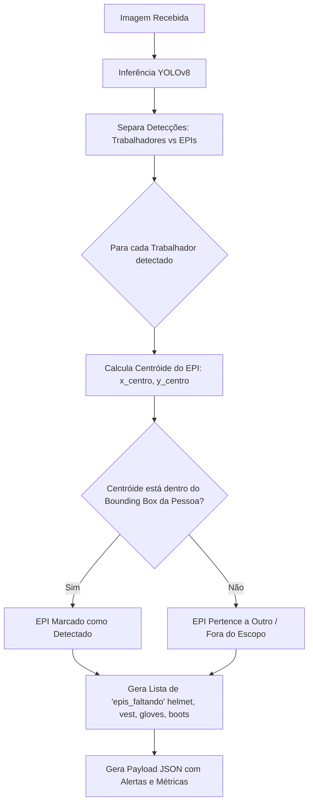

# 🛡️ Edge-AI-EPI: Detecção e Monitoramento de EPIs em Tempo Real

[](https://www.python.org/)
[](https://fastapi.tiangolo.com/)
[](https://docs.ultralytics.com/)
[](https://opencv.org/)
[](LICENSE)

Sistema de Visão Computacional e **Edge AI** para detecção automática de **Equipamentos de Proteção Individual (EPIs)** e validação de conformidade de segurança do trabalho em tempo real.

O projeto utiliza um modelo customizado **YOLOv8** integrado a uma **API REST de alta performance construída com FastAPI**, capaz de processar imagens e fluxos de vídeo, associar geometricamente cada item de proteção aos trabalhadores detectados e alertar sobre itens ausentes.

---

## 📑 Tabela de Conteúdos

- [Visão Geral](#-visão-geral)
- [Funcionalidades](#-funcionalidades)
- [Classes Monitoradas](#-classes-monitoradas)
- [Métricas e Performance do Modelo](#-métricas-e-performance-do-modelo)
- [Lógica de Associação Pessoa-EPI](#-lógica-de-associação-pessoa-epi)
- [Estrutura do Projeto](#-estrutura-do-projeto)
- [Como Começar](#-como-começar)
  - [Pré-requisitos](#pré-requisitos)
  - [Instalação](#instalação)
  - [Download do Dataset (Roboflow)](#download-do-dataset-roboflow)
  - [Executando a API REST](#executando-a-api-rest)
  - [Executando a Prova de Conceito (POC / Câmera)](#executando-a-prova-de-conceito-poc--câmera)
  - [Treinamento do Modelo](#treinamento-do-modelo)
- [Documentação dos Endpoints](#-documentação-dos-endpoints)
- [Variáveis de Ambiente](#-variáveis-de-ambiente)
- [Tecnologias Utilizadas](#-tecnologias-utilizadas)
- [Autor e Licença](#-autor-e-licença)

---

## 🎯 Visão Geral

Em ambientes industriais, portuários e de construção civil, a garantia do uso correto de EPIs é indispensável para a mitigação de acidentes e conformidade regulatória (como a NR-6). 

O **Edge-AI-EPI** foi projetado para:
1. **Detectar trabalhadores e múltiplos itens de proteção** com alta taxa de acerto e baixa latência.
2. **Associar espacialmente os EPIs a cada pessoa identificada**, sem depender de regras rígidas de posicionamento que falham em mudanças de ângulo, perspectiva ou postura (curvado, de lado, etc.).
3. **Gerar diagnósticos instantâneos de conformidade**: informando com precisão quais EPIs estão presentes e quais estão em falta por trabalhador.
4. **Fornecer uma interface pronta para produção** via endpoints HTTP com FastAPI (JSON estruturado e imagens anotadas).

---

## ✨ Funcionalidades

- **Detecção Multiclasse Otimizada**: Identificação simultânea de pessoas e 4 tipos essenciais de EPI.
- **Associação Espacial Dinâmica**: Algoritmo de mapeamento centróide-bbox que valida se o item de segurança pertence à área corporal do trabalhador.
- **Relatório Automatizado de Faltas**: Resposta estruturada com `epis_detectados` e `epis_faltando` para cada colaborador na cena.
- **API REST Pronta para Produção**:
  - Endpoint de predição com resposta em JSON rico (bounding boxes, níveis de confiança, alertas e tempo de inferência).
  - Endpoint para retorno visual da imagem anotada (`image/png`).
  - Healthcheck para probes de liveness em orquestradores (Kubernetes/Docker).
- **Flexibilidade de Execução**: Suporte a aceleração em GPU (CUDA) ou CPU com carregamento único do modelo em memória.

---

## 🏷️ Classes Monitoradas

O modelo foi treinado para reconhecer 5 classes distintas:

| ID | Classe | Descrição |
|:--:|:-------|:----------|
| `0` | `boots` | Botas e calçados de segurança |
| `1` | `gloves` | Luvas de proteção |
| `2` | `helmet` | Capacetes de segurança |
| `3` | `human` | Trabalhador / Pessoa |
| `4` | `vest` | Coletes reflexivos / de alta visibilidade |

---

## 📊 Métricas e Performance do Modelo

O modelo foi treinado por **60 épocas** com `batch=16`, resolução `640x640` e taxa de aprendizado adaptativa, alcançando resultados de excelência para cenários de monitoramento:

| Métrica | Valor Obtido |
|:--------|:------------:|
| **mAP@50** | **~93.5%** |
| **mAP@50-95** | **~73.2%** |
| **Precisão (Precision)** | **~94.0%** |
| **Recall (Revocação)** | **~89.8%** |
| **Backbone Base** | YOLOv8 Nano (`yolov8n.pt`) |

> 💡 **Nota sobre Edge AI:** O uso da variante *Nano* do YOLOv8 garante baixo consumo de VRAM/RAM e latência reduzida (< 25ms em GPUs dedicadas e tempo viável para inferência em CPUs ou dispositivos embarcados como NVIDIA Jetson e Raspberry Pi 5).

---

## 🧠 Lógica de Associação Pessoa-EPI

Diferente de abordagens estáticas que dividem o corpo em porcentagens fixas de altura (o que causa falsos positivos e negativos quando a pessoa se agacha ou está em ângulos inclinados), o algoritmo de validação utiliza associação espacial por centróide:



---

## 📁 Estrutura do Projeto

```plaintext
Edge-AI-EPI/
│
├── main.py                 # Aplicação FastAPI com endpoints REST e lógica de predição
├── poc.py                  # Script de Prova de Conceito (OpenCV + visualização em tempo real)
├── train.py                # Pipeline de treinamento do modelo YOLOv8
├── baixar_image.py         # Script de ingestão/download do dataset via Roboflow
├── yolov8n.pt              # Pesos pré-treinados base
├── requirements.txt        # Dependências e bibliotecas do projeto
├── .gitignore              # Regras de exclusão do Git
├── README.md               # Documentação técnica do projeto
│
├── PPE-Detection-1/        # Dataset anotado (imagens e anotações YOLO)
│   ├── data.yaml           # Configuração de caminhos e nomes das classes
│   ├── train/              # Conjunto de treino
│   ├── valid/              # Conjunto de validação
│   └── test/               # Conjunto de testes
│
└── runs/
    └── detect/
        └── train-8/        # Artefatos do treinamento principal
            ├── weights/
            │   └── best.pt # Melhores pesos gerados durante o treino
            ├── results.png # Gráficos de perda, mAP, precisão e recall
            └── results.csv # Log numérico das épocas de treino
```

---

## 🚀 Como Começar

### Pré-requisitos

- **Python 3.10+** instalado no sistema.
- Gerenciador de pacotes `pip`.
- (Opcional) Driver NVIDIA e CUDA Toolkit configurados para aceleração por GPU.

### Instalação

1. Clone o repositório:
```bash
git clone https://github.com/abegaorodrigo/Edge-AI-EPI.git
cd Edge-AI-EPI
```

2. Crie e ative um ambiente virtual:
```bash
# Windows
python -m venv .venv
.venv\Scripts\activate

# Linux / macOS
python3 -m venv .venv
source .venv/bin/activate
```

3. Instale as dependências a partir do `requirements.txt`:
```bash
pip install -r requirements.txt
```

---

### Download do Dataset (Roboflow)

Para obter ou atualizar a pasta do dataset anotado (`PPE-Detection-1/`), exporte o dataset no formato **YOLOv8** diretamente pelo Roboflow e execute o download:

1. Obtenha o snippet de exportação gerado pelo Roboflow (ou utilize o script [`baixar_image.py`](baixar_image.py) já presente no projeto):

```python
from roboflow import Roboflow

rf = Roboflow(api_key="SUA_API_KEY")
project = rf.workspace("workspace-name").project("ppe-detection")
dataset = project.version(1).download("yolov8")
```

2. Esse comando fará o download e gerará automaticamente a pasta do dataset (ex: `PPE-Detection-1/`) contendo o arquivo `data.yaml` e as divisões `train/`, `valid/` e `test/` (imagens e rótulos) já no formato esperado pelo script de treinamento.

---

### Executando a API REST

Inicie o servidor HTTP com Uvicorn:

```bash
uvicorn main:app --host 0.0.0.0 --port 8000 --reload
```

A API estará disponível em `http://localhost:8000`.
Acesse a documentação interativa Swagger em: **`http://localhost:8000/docs`**.

---

### Executando a Prova de Conceito (POC / Câmera)

Para testar a detecção em uma imagem local ou webcam via janela interativa do OpenCV:

```bash
python poc.py
```

- Para alternar entre imagem estática e webcam, edite as linhas de captura em `poc.py`.
- Pressione a tecla **`q`** na janela de exibição para encerrar.

---

### Treinamento do Modelo

Para re-treinar o modelo com novas épocas ou datasets customizados:

```bash
python train.py
```

Os parâmetros padrão configurados são:
- `epochs=60`
- `imgsz=640`
- `batch=16`
- `patience=15`
- `workers=4`

---

## 🔌 Documentação dos Endpoints

### 1. `GET /health`
Verifica a integridade e disponibilidade da API.

- **Resposta de Exemplo (`200 OK`)**:
  ```json
  {
    "status": "ok"
  }
  ```

---

### 2. `POST /predict`
Recebe uma imagem via `multipart/form-data` e retorna as coordenadas das detecções, conferência de EPIs por trabalhador e o tempo total de inferência.

- **Parâmetros**:
  - `file`: Arquivo de imagem (`image/jpeg`, `image/png`, etc.)

- **Exemplo de Requisição via cURL**:
  ```bash
  curl -X POST "http://localhost:8000/predict" \
       -H "accept: application/json" \
       -H "Content-Type: multipart/form-data" \
       -F "file=@caminho/para/imagem.jpg"
  ```

- **Exemplo de Resposta (`200 OK`)**:
  ```json
  {
    "deteccoes": [
      {
        "classe": "human",
        "confianca": 0.942,
        "bbox": [150.2, 80.5, 410.0, 620.8]
      },
      {
        "classe": "helmet",
        "confianca": 0.915,
        "bbox": [220.0, 85.0, 310.4, 175.2]
      },
      {
        "classe": "vest",
        "confianca": 0.887,
        "bbox": [170.1, 180.3, 380.5, 420.0]
      }
    ],
    "alertas": [
      {
        "pessoa_bbox": [150.2, 80.5, 410.0, 620.8],
        "epis_detectados": [
          "helmet",
          "vest"
        ],
        "epis_faltando": [
          "gloves",
          "boots"
        ]
      }
    ],
    "tempo_inferencia_ms": 18.45
  }
  ```

---

### 3. `POST /predict/annotated`
Recebe uma imagem e retorna a visualização gráfica processada com as caixas delimitadoras e rótulos sobrepostos em formato binário PNG.

- **Exemplo de Requisição via cURL**:
  ```bash
  curl -X POST "http://localhost:8000/predict/annotated" \
       -F "file=@caminho/para/imagem.jpg" \
       --output resultado_anotado.png
  ```

---

### Exemplo de Integração em Python

```python
import requests

url = "http://localhost:8000/predict"
caminho_imagem = "imagem_epi_teste.jpg"

with open(caminho_imagem, "rb") as img:
    files = {"file": img}
    response = requests.post(url, files=files)

dados = response.json()
print("Tempo de Inferência:", dados["tempo_inferencia_ms"], "ms")

for i, alerta in enumerate(dados["alertas"], 1):
    print(f"\n--- Trabalhador #{i} ---")
    print("EPIs em Uso:", ", ".join(alerta["epis_detectados"]) or "Nenhum")
    print("⚠️ FALTANDO:", ", ".join(alerta["epis_faltando"]) or "Nenhum (100% Conforme)")
```

---

## ⚙️ Variáveis de Ambiente

É possível customizar os caminhos dos modelos e dados sem alterar o código-fonte através de variáveis de ambiente:

| Variável | Padrão | Descrição |
|:---------|:-------|:----------|
| `MODEL_PATH` | `.\runs\detect\train-8\weights\best.pt` | Caminho para os pesos do modelo YOLOv8 utilizado pela API (`main.py`) |
| `TRAIN_MODEL_PATH` | `yolov8n.pt` | Modelo base de partida para o script de treino (`train.py`) |
| `TRAIN_DATA_PATH` | `.\PPE-Detection-1\data.yaml` | Caminho do manifesto de dados para o treino (`train.py`) |

---

## 🛠️ Tecnologias Utilizadas

- **[Ultralytics YOLOv8](https://github.com/ultralytics/ultralytics)** - Arquitetura de ponta para detecção de objetos em tempo real.
- **[FastAPI](https://fastapi.tiangolo.com/)** - Framework web assíncrono e de alta velocidade para criação de APIs REST.
- **[OpenCV](https://opencv.org/)** & **[NumPy](https://numpy.org/)** - Manipulação, decodificação e processamento matricial de imagens.
- **[Uvicorn](https://www.uvicorn.org/)** - Servidor ASGI para execução assíncrona.
- **[Roboflow](https://roboflow.com/)** - Plataforma de gerenciamento e anotação do dataset de EPIs.

---

## 👤 Autor

Desenvolvido por **Rodrigo Abegão**  
GitHub: [@abegaorodrigo](https://github.com/abegaorodrigo)

---

## 📄 Licença

Este projeto está sob a licença [MIT](LICENSE). Sinta-se livre para utilizar, modificar e distribuir.
